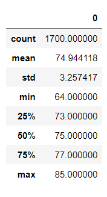
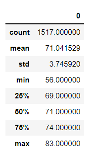

# SurfsUp

## Overview of the Analysis
The overall task given is to determine if a business in Hawaii would survive based on the severity of the weather. The purpose of this repository is to analyze the rainfall in Hawaii in the months June and December. In deliverable 1 and 2, the describe function better illustrates the amount of rainfall.

## Results

## Summary
